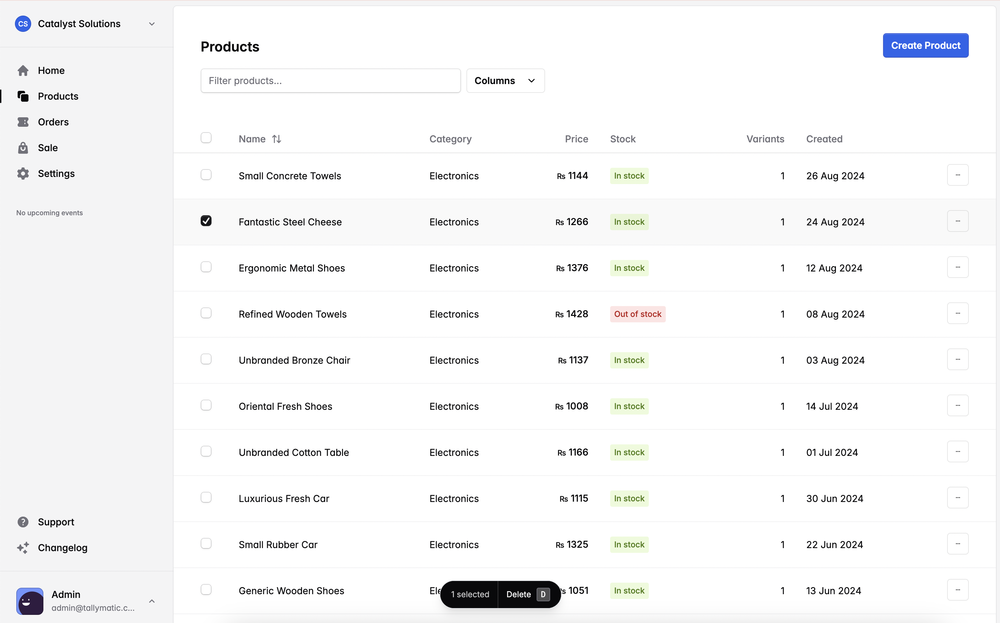

# Tallymatic - Point of Sale System

✨ **Tallymatic** is a modern Point of Sale (POS) system designed to streamline product management, sales, and purchases for businesses of all sizes.



## Key Features

- Product Management: Add, edit, and manage your product catalog
- Sales Processing: Easily create and process sales transactions
- Purchase Management: Track and manage product purchases
- Inventory Control: Real-time inventory tracking and management
- Reporting: Generate insightful reports on sales, purchases, and inventory

## Getting Started

### Prerequisites

- Node.js (v14 or later)
- npm (v6 or later)
- PostgreSQL (v12 or later)

### Setup

1. Clone the repository:

   ```
   git clone https://github.com/your-repo/tallymatic.git
   cd tallymatic
   ```

2. Install dependencies:

   ```
   npm install
   ```

3. Set up environment variables:

   - Copy `.env.example` to `.env` in the `apps/api` directory
   - Copy `.env.example` to `.env` in the `apps/dashboard` directory
   - Update the `.env` file with your database credentials and other configuration

4. Set up the database:
   ```
   npm run db:create
   npm run migrate:dev
   npm run seed:dev
   ```

## Running the Projects

### API (Backend)

To start the API server in development mode:

```
nx serve api
```

### Dashboard (Frontend)

To start client in development mode:

```
nx serve dashboard
```
